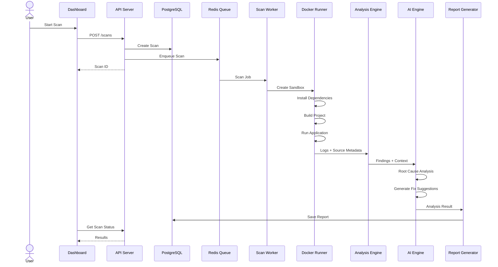

# Scan Sequence

```mermaid
sequenceDiagram

    actor User
    participant UI as Dashboard
    participant API as API Server
    participant DB as PostgreSQL
    participant Q as Redis Queue
    participant W as Scan Worker
    participant R as Docker Runner
    participant A as Analysis Engine
    participant AI as AI Engine
    participant Report as Report Generator

    User->>UI: Start Scan
    UI->>API: POST /scans
    API->>DB: Create Scan
    API->>Q: Enqueue Scan
    API-->>UI: Scan ID

    Q->>W: Scan Job
    W->>R: Create Sandbox
    R->>R: Install Dependencies
    R->>R: Build Project
    R->>R: Run Application

    R->>A: Logs + Source Metadata
    A->>AI: Findings + Context
    AI->>AI: Root Cause Analysis
    AI->>AI: Generate Fix Suggestions

    AI->>Report: Analysis Result
    Report->>DB: Save Report

    UI->>API: Get Scan Status
    API-->>UI: Results
```